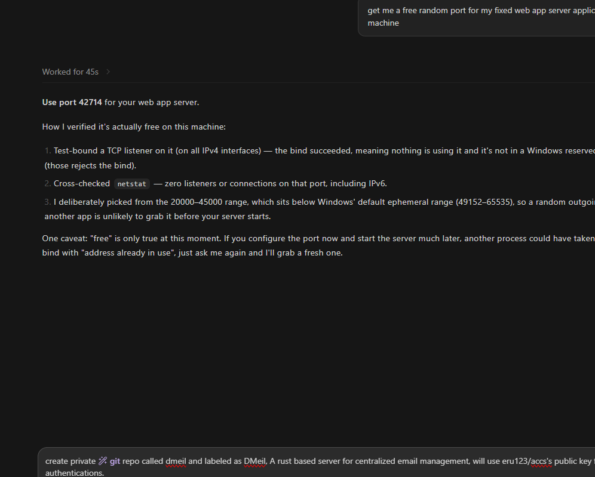

# MTKey

That `def50200...` blob sitting in your `.env` file, or the JWT you paste into jwt.io for the fifth time this week, or the RSA key pair you need for class tomorrow. All of them are puzzles you can actually take apart, and this is the workbench for doing it.

MTKey is a free Windows app (one exe, no installer, no account) with 38 cipher, hash and token tools on board. Every method has a Wikipedia link next to it, a plain-language explanation of how it works, and a dice button that rolls fresh keys, salts and IVs for you. It was built for students, self-taught developers and the merely curious, not for auditors.



## Why you will keep it open

- **Learn while you poke.** Pick a cipher, read the two-paragraph explainer, click the 🔗 link for the deep dive, then watch the output update live as you type. Base64, Caesar, Vigenère, Playfair, Rail fence, XOR, Morse, Base58 and friends.
- **Hashes that behave like hashes.** MD5 through SHA-512, HMAC, CRC-32, PBKDF2. One-way functions show a Hash button only, so the app itself teaches you there is no un-hashing.
- **Real modern crypto, safely sandboxed.** AES-GCM (tamper a byte and watch it refuse), AES-CBC, the deliberately dangerous AES-ECB penguin lesson, DES and 3DES as museum pieces, RSA-OAEP and RSA signatures.
- **RSA without the ceremony.** Click the dice on either key field and a matched public and private pair appears together, because they are born together. Paste your own keys and MTKey verifies on the spot whether they actually pair.
- **JWT and JWKS demystified.** Sign tokens with HS256 or RS256, decode any token into readable JSON, check signatures and expiry claims, and build or inspect JSON Web Key Sets.
- **It speaks PHP.** The full string-crypto surface of [defuse/php-encryption](https://github.com/defuse/php-encryption) is ported byte for byte. Ciphertexts that start with `def50200` decrypt here, and ciphertexts made here decrypt in PHP. Verified in both directions against the real library, not just against my own tests.

## The defuse compatibility promise

The four Defuse methods cover the library's string API: authenticated encryption with a stored key (`def00000...`), password encryption with PBKDF2 at 100,000 rounds, the password-protected key wrapper (`def10000...`), and a legacy reader for version 1 ciphertexts. The wire format is identical: `hex(DE F5 02 00 || salt || IV || AES-256-CTR || HMAC-SHA256)`. File streaming encryption is the same primitives applied per chunk, so it stayed out of a text tool.

To see the proof yourself, run `mtkey --selftest`. The last line checks ciphertexts produced by the actual PHP library, and the repo's CI regenerates those vectors from a fresh defuse checkout on every push.

## What is in the box

| Category | Methods |
| --- | --- |
| Encoding | Base64, Base32, Base58, Hex, URL, Binary, Morse |
| Classical | Caesar, ROT13, Atbash, Vigenère, Rail fence, Playfair, XOR |
| Hash | MD5, SHA-1, SHA-256, SHA-384, SHA-512, SHA-3*, HMAC (MD5/SHA-1/SHA-256/SHA-512), CRC-32, PBKDF2 |
| Modern | AES-256-GCM, AES-CBC, AES-ECB, DES, Triple DES, RSA-OAEP, RSA signatures |
| Defuse PHP | Authenticated (key), With password, Key tool (wrap/unlock), Legacy v1 decrypt |
| Tokens | JWT (sign/decode/verify), JWKS (build/inspect) |

*SHA-3 appears only on Windows builds new enough to expose it.

## Download

Grab `mtkey-win-x64.exe` from the [releases page](../../releases). It is a single self-contained file, about 70 MB, runs on Windows 10 and 11, and phones nobody home. If you prefer building it yourself, the whole thing is three `dotnet` commands away and needs nothing from Visual Studio.

## Command line

The GUI is the main event, but everything is scriptable too:

```
mtkey --run base64 encode "hello world"
mtkey --run caesar encrypt --set shift=13 "et tu, brute?"
mtkey --run sha256 hash "abc"
mtkey --run defuse-password decrypt --set password=hunter2 "def50200..."
mtkey --list          # every method, with ids for --run
mtkey --selftest      # 38 known-answer and roundtrip checks
```

## Build it yourself

You need the .NET 8 SDK and nothing else. Git Bash, PowerShell or cmd all work.

```
git clone https://github.com/eru123/mtkey.git
cd mtkey
dotnet build
dotnet run --project src/Mtkey
```

Run the tests:

```
dotnet test
```

For the full defuse cross-language suite, also clone the PHP library and regenerate the vectors, exactly like CI does:

```
git clone --depth 1 https://github.com/defuse/php-encryption.git ../defuse-ref
php tools/gen-vectors.php > tests/Mtkey.Tests/vectors.json
dotnet test
```

To produce the single-file release exe:

```
dotnet publish src/Mtkey -c Release -r win-x64 --self-contained true -p:PublishSingleFile=true -o dist
```

## A word on safety

This is a learning tool. It handles real algorithms with real keys, but you should not manage production secrets in a GUI text box. Nothing you type is sent anywhere; still, treat the app like a whiteboard, not a vault.

## License

[MIT](LICENSE), so you can read the code, fork it, and make it yours. That is rather the point.
